## Windows Server 2022 Hyper-V + Active Directory Lab

## Project Overview

This project demonstrates a fully functional enterprise-style virtualized infrastructure built using Windows Server 2022 running on a **Dell PowerEdge R720 server** with **Hyper-V** role enabled. The environment includes domain services, DNS, virtual machines, and client domain integration.

The lab simulates a real-world IT enterprise setup used for:

- Active Directory administration

- Domain controller configuration

- Hyper-V virtualization management

- Network and DNS services

- Client-server domain authentication

## Technologies Used

- Windows Server 2022

- Active Directory Domain Services (AD DS)

- DNS Server Role

- Hyper-V Virtualization

- Windows 11 Virtual Machine

- PowerShell Administration

- Virtual Networking (External Switch)

## Key Features Implemented

- Active Directory Domain Controller setup

- DNS integrated with AD

- Hyper-V virtualization environment

- External virtual switch networking

- Windows 11 VM deployment

- Domain join and authentication

- Network configuration with static IP

## Screenshots & Commands

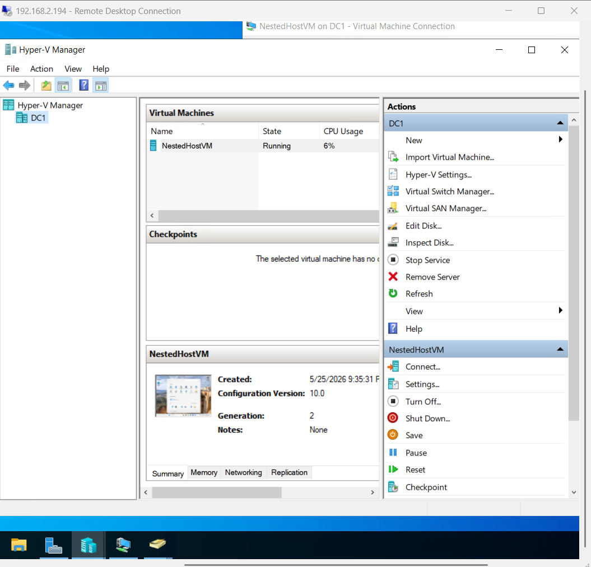

## 1. Hyper-V Virtual Machines

Get-VM
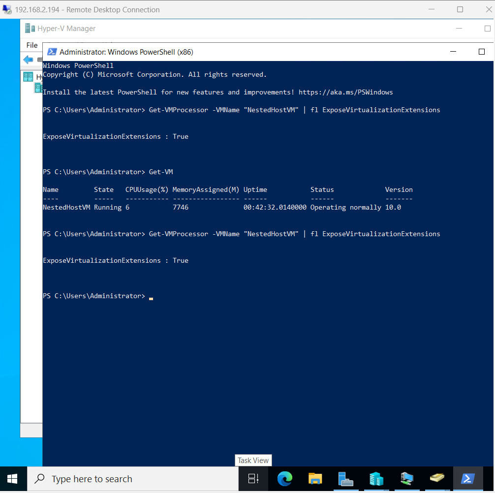

## 2. VM Processor Virtualization

Get-VMProcessor -VMName "NestedHostVM" | fl ExposeVirtualizationExtensions

## 3. Active Directory Role

## Organizational Units (OUs)
- IT_DELL
- HR_DELL
- SALES_DELL

## Users Created
- ITDELLUSER1 → IT_DELL
- HRDELLUSER1 → HR_DELL
- SALESDELLUSER1 → SALES_DELL

---

##  Group Policy Configuration

##  IT Department (Full Access)
- Control Panel: Enabled
- Command Prompt: Enabled
- Full administrative-style access

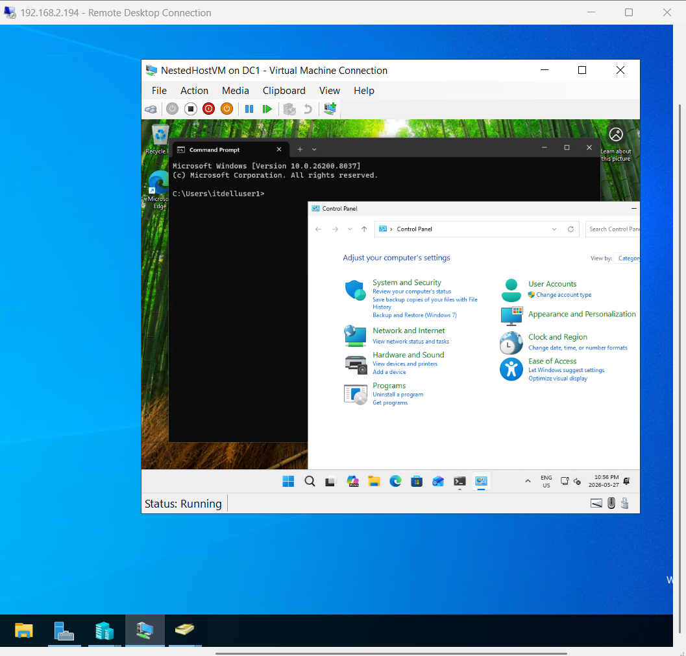

##  HR Department (Restricted Access)
- Control Panel: Disabled
- Command Prompt: Disabled
- Highly restricted system access for security compliance

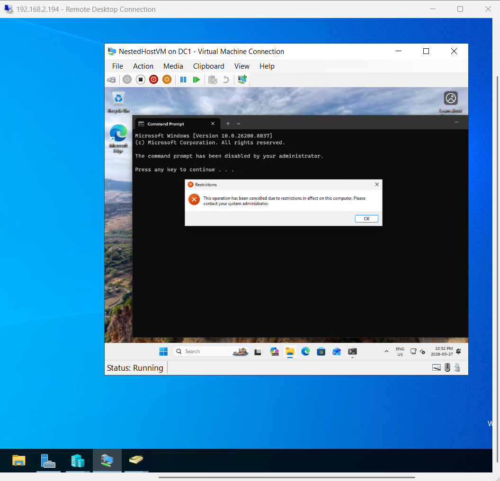

##  SALES Department (Standard Access)
- Control Panel: Disabled
- Command Prompt: Enabled
- Balanced user environment for business operations

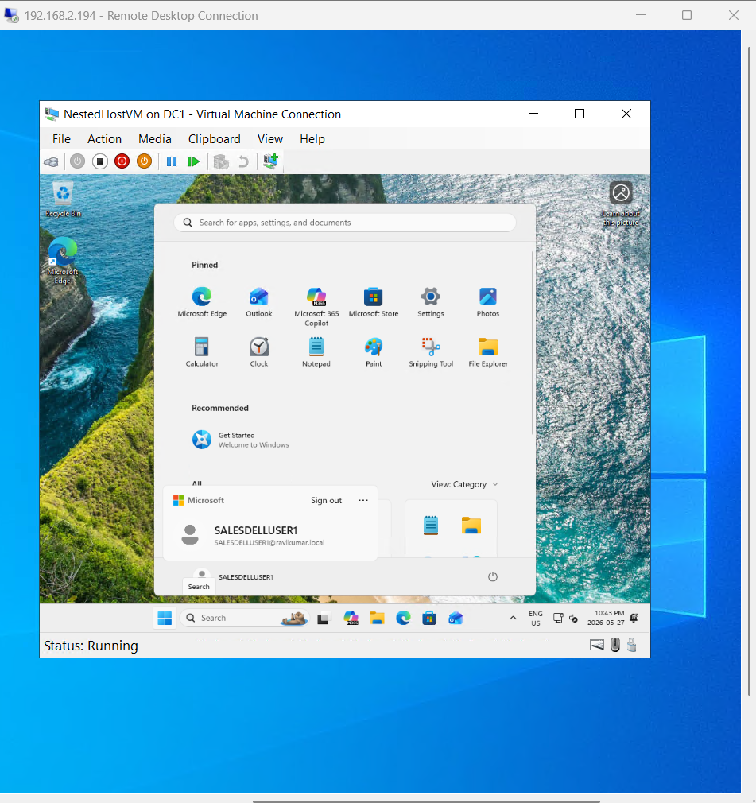

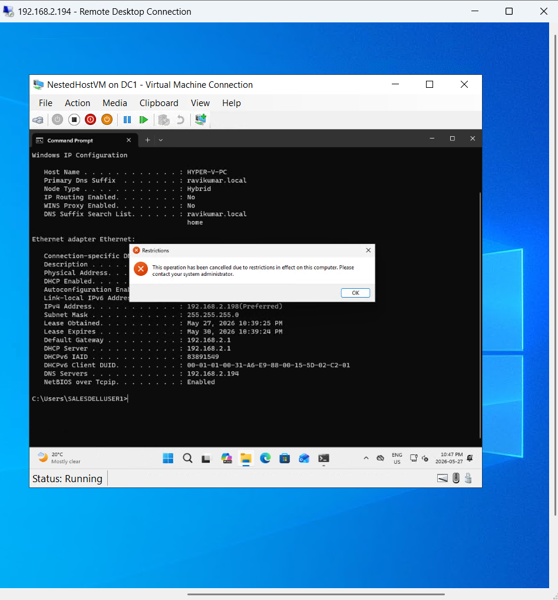

## 4. Domain Verification

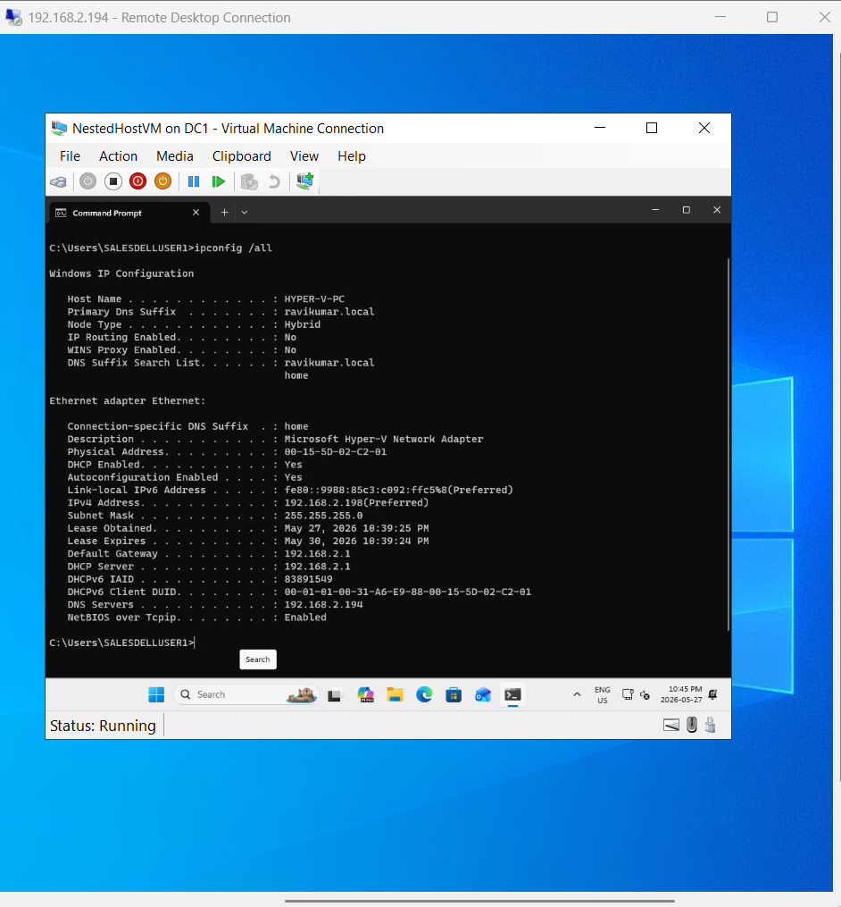

## 5. Virtual Switches

Get-VMSwitch

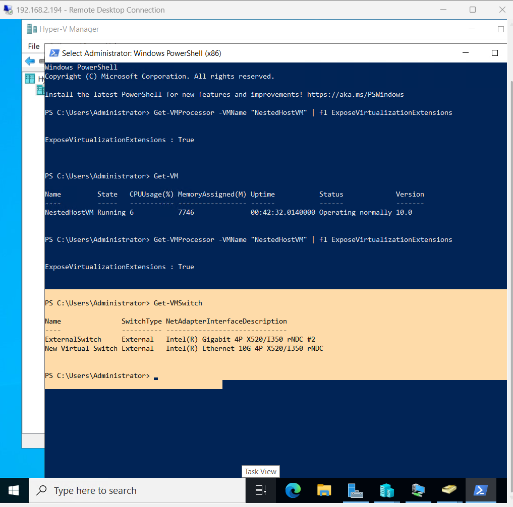

## 6. VM Network Adapter

Get-VMNetworkAdapter -VMName "NestedHostVM"

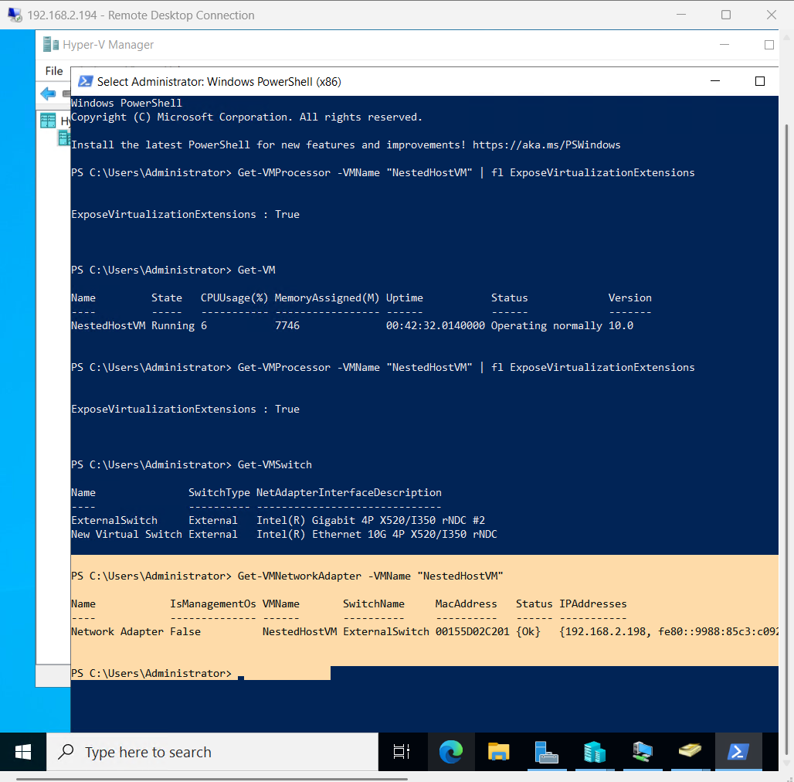

## 7. IP Configuration (Client)

ipconfig /all

## 8. Host info
systeminfo

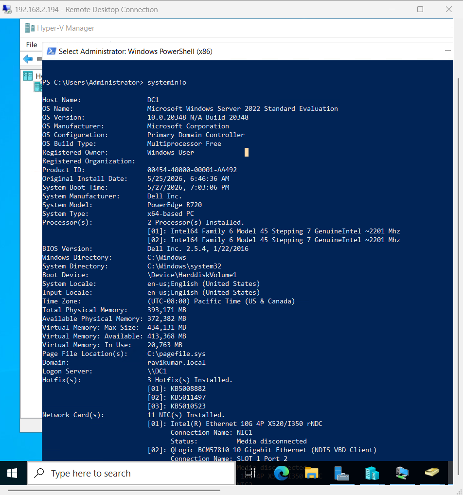

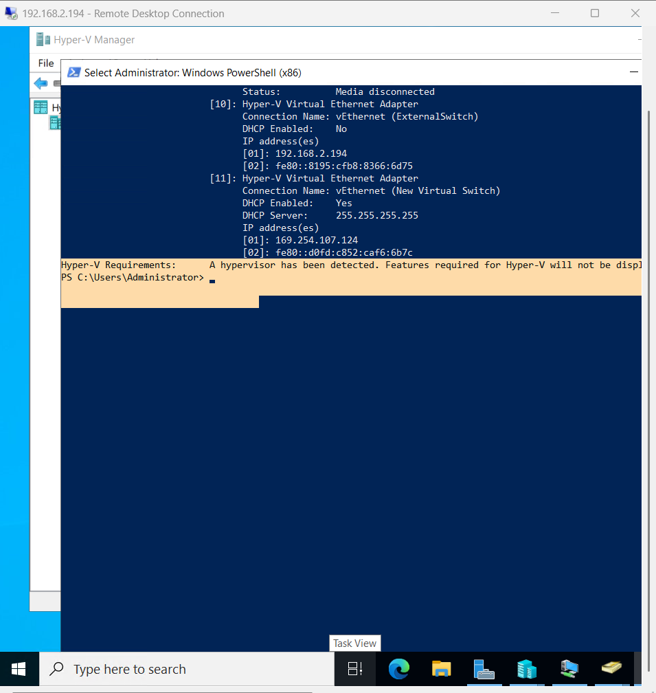

## Skills Demonstrated

- Windows Server Administration

- Active Directory Management

- DNS Configuration

- Hyper-V Virtualization

- Virtual Machine Deployment

- Network Configuration (Static IP / External Switch)

- Domain Joining & Authentication

- System Monitoring & Troubleshooting

- PowerShell Automation

## Future Improvements

- Add multiple domain-joined clients

- Implement DHCP server role

- Configure Group Policy Objects (GPO) in depth

- Add file server role (SMB shares)

- Implement backup automation

- Create nested virtualization lab (Hyper-V inside VM)

## Author

Ravi Kumar

